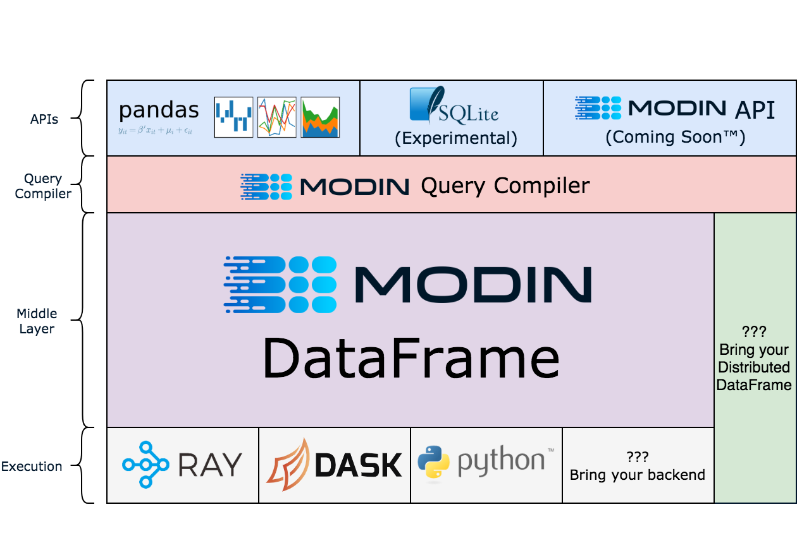

<p align="center"><a href="https://modin.readthedocs.io"></a></p>
<h2 align="center">Scale your pandas workflows by changing one line of code</h2>

<p align="center">
<a href="https://discuss.modin.org"></a>
<a href="https://codecov.io/gh/modin-project/modin"></a>
<a href="https://github.com/modin-project/modin/actions"></a>
<a href="https://modin.readthedocs.io/en/latest/?badge=latest"></a>
<a href="https://pypi.org/project/modin/"></a>
</p>

<p align="center"><b>To use Modin, replace the pandas import:</b></p>

```python
# import pandas as pd
import modin.pandas as pd
```

### Installation

Modin can be installed from PyPI:

```bash
pip install modin
```

If you don't have [Ray](https://github.com/ray-project/ray) or 
[Dask](https://github.com/dask/dask) installed, you will need to install Modin with one
of the targets:

```bash
pip install modin[ray] # Install Modin dependencies and Ray to run on Ray
pip install modin[dask] # Install Modin dependencies and Dask to run on Dask
pip install modin[all] # Install all of the above
```
Modin will automatically detect which engine you have installed and use that for
scheduling computation!

### Pandas API Coverage

<p align="center">

| pandas Object     | Modin's Ray Engine Coverage                                                          | Modin's Dask Engine Coverage |
|-------------------|:------------------------------------------------------------------------------------:|:---------------:|
| `pd.DataFrame`    |  |  |
| `pd.Series`       |  |  |
| `pd.read_csv`     | ✅                                               | ✅ |
| `pd.read_table`   | ✅                                               | ✅ |
| `pd.read_parquet` | ✅                                               | ✅ |
| `pd.read_sql`     | ✅                                               | ✅ |
| `pd.read_feather` | ✅                                               | ✅ |
| `pd.read_excel`   | ✅                                               | ✅ |
| `pd.read_json`    | [✳️](https://github.com/modin-project/modin/issues/554)                                         | [✳️](https://github.com/modin-project/modin/issues/554) |
| `pd.read_<other>` | [✴️](https://modin.readthedocs.io/en/latest/supported_apis/io_supported.html) | [✴️](https://modin.readthedocs.io/en/latest/supported_apis/io_supported.html) |


</p>
Some pandas APIs are easier to implement than other, so if something is missing feel
free to open an issue!


##### Choosing a Compute Engine

If you want to choose a specific compute engine to run on, you can set the environment
variable `MODIN_ENGINE` and Modin will do computation with that engine:

```bash
export MODIN_ENGINE=ray  # Modin will use Ray
export MODIN_ENGINE=dask  # Modin will use Dask
```

This can also be done within a notebook/interpreter before you import Modin:

```python
import os

os.environ["MODIN_ENGINE"] = "ray"  # Modin will use Ray
os.environ["MODIN_ENGINE"] = "dask"  # Modin will use Dask

import modin.pandas as pd
```

**Note: You should not change the engine after you have imported Modin as it will result in undefined behavior**

##### Which engine should I use?

If you are on Windows, you must use Dask. Ray does not support Windows. If you are on
Linux or Mac OS, you can install and use either engine. There is no knowledge required
to use either of these engines as Modin abstracts away all of the complexity, so feel
free to pick either!

##### Advanced usage

In Modin, you can start a custom environment in Dask or Ray and Modin will connect to
that environment automatically. For example, if you'd like to limit the amount of
resources that Modin uses, you can start a Dask Client or Initialize Ray and Modin will
use those instances. Make sure you've set the correct environment variable so Modin
knows which engine to connect to!

For Ray:
```python
import ray
ray.init(plasma_directory="/path/to/custom/dir", object_store_memory=10**10)
# Modin will connect to the existing Ray environment
import modin.pandas as pd
```

For Dask:
```python
from distributed import Client
client = Client(n_workers=6)
# Modin will connect to the Dask Client
import modin.pandas as pd
```

This gives you the flexibility to start with custom resource constraints and limit the
amount of resources Modin uses.


### Full Documentation

Visit the complete documentation on readthedocs: https://modin.readthedocs.io

### Scale your pandas workflow by changing a single line of code.


```python
import modin.pandas as pd
import numpy as np

frame_data = np.random.randint(0, 100, size=(2**10, 2**8))
df = pd.DataFrame(frame_data)
```
**In local (without a cluster) modin will create and manage a local (dask or ray) cluster for the execution**


To use Modin, you do not need to know how many cores your system has and you do not need
to  specify how to distribute the data. In fact, you can continue using your previous
pandas notebooks while experiencing a considerable speedup from Modin, even on a single
machine. Once you've changed your import statement, you're ready to use Modin just like
you would pandas.


#### Faster pandas, even on your laptop

</a>

The `modin.pandas` DataFrame is an extremely light-weight parallel DataFrame. Modin 
transparently distributes the data and computation so that all you need to do is
continue using the pandas API as you were before installing Modin. Unlike other parallel
DataFrame systems, Modin is an extremely light-weight, robust DataFrame. Because it is
so light-weight, Modin provides speed-ups of up to 4x on a laptop with 4 physical cores.

In pandas, you are only able to use one core at a time when you are doing computation of
any kind. With Modin, you are able to use all of the CPU cores on your machine. Even in
`read_csv`, we see large gains by efficiently distributing the work across your entire
machine.

```python
import modin.pandas as pd

df = pd.read_csv("my_dataset.csv")
```

#### Modin is a DataFrame designed for datasets from 1MB to 1TB+ 

We have focused heavily on bridging the solutions between DataFrames for small data 
(e.g. pandas) and large data. Often data scientists require different tools for doing
the same thing on different sizes of data. The DataFrame solutions that exist for 1KB do
not scale to 1TB+, and the overheads of the solutions for 1TB+ are too costly for 
datasets in the 1KB range. With Modin, because of its light-weight, robust, and scalable
nature, you get a fast DataFrame at small and large data. With preliminary [cluster](https://modin.readthedocs.io/en/latest/using_modin.html#using-modin-on-a-cluster)
and [out of core](https://modin.readthedocs.io/en/latest/out_of_core.html)
support, Modin is a DataFrame library with great single-node performance and high
scalability in a cluster.

#### Modin Architecture

We designed Modin to be modular so we can plug in different components as they develop
and improve:



Visit the [Documentation](https://modin.readthedocs.io/en/latest/developer/architecture.html) for
more information, and checkout [the difference between Modin and Dask!](https://github.com/modin-project/modin/tree/master/docs/modin_vs_dask.md)

**`modin.pandas` is currently under active development. Requests and contributions are welcome!**


### More information and Getting Involved

- [Documentation](https://modin.readthedocs.io/en/latest/)
- Ask questions or participate in discussions on our [Discourse](https://discuss.modin.org)
- Join our mailing list [modin-dev@googlegroups.com](https://groups.google.com/forum/#!forum/modin-dev)
- Submit bug reports to our [GitHub Issues Page](https://github.com/modin-project/modin/issues)
- Contributions are welcome! Open a [pull request](https://github.com/modin-project/modin/pulls)
