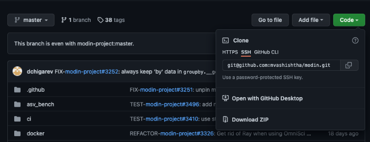
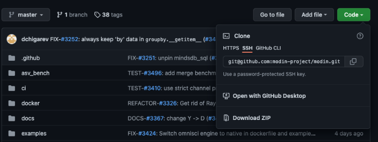

# Modin dev onboarding

1. [Set up git](https://docs.github.com/en/get-started/quickstart/set-up-git)
1. [install anaconda](https://www.anaconda.com/products/individual#macos). Once installed,
you should reopen your terminal to find "(base)" next to your prompt: 
1. [Generate an SSH key](https://docs.github.com/en/authentication/connecting-to-github-with-ssh/generating-a-new-ssh-key-and-adding-it-to-the-ssh-agent) for GitHub
1. Fork the [modin repo](https://github.com/modin-project/modin) on GitHub
1. Clone the forked repo in a local directory of your choice: 
    ```
    git clone ${PATH_TO_REPO}
    ```
    where the path can be found here: 
4. Inside the cloned "modin" directory, add a remote branch called "upstream":
   ```
   git remote add upstream git@github.com:modin-project/modin.git
   ```
   where the upstream link comes from here: 
1. Fetch the upstream branch:
    ```
    git fetch upstream
    ```
1. Set the default remote branch for your local main branch. 
    ```
     git branch --set-upstream-to=upstream/main main
    ```
1. Install modin from local source code, and install all its dependencies:
    ```
     pip install -e ".[all]"
    ```
1. Install ipython:
    ```
    pip install ipython
    ```
1. If you ever want to install modin at a release version (not the editable version from your machine): 
    ```
    pip install modin
    ```
1. If you want a specific version:
    ```
    pip install modin==0.11
    ```
1. To upgrade modin to the newest available version:
    ```
    pip install -U modin
    ```
1. Now go back to local modin.
    ```
    pip install -e .
    ```
1. Try out modin in ipython:
    ```
    ipython
    import modin
    modin.__version__
    ```
    You should see the Modin version, which consists of the version, the last commit number, and the last commit hash.

1. List Modin versions:
    ```
    git tag
    ```

1. Get a summary of a particular release:
    ```
    git tag -l --format='%(contents)' 0.11.0
    ```

1. Check out the developer requirements in `requirements-dev.txt`. Install them with:
    ```
    pip install -r requirements-dev.txt
    ```

1. Try a unit test:
    ```
    pytest modin/tests/pandas/test_concat.py
    ```

1. [Add a GPG key](https://docs.github.com/en/authentication/managing-commit-signature-verification/adding-a-new-gpg-key-to-your-github-account ) to your Modin account. Your commits need to be signed with a GPG key. For mac, you can use [Mac GPG](https://gpgtools.org/).


1. (Optional) We recommend a few workflow settings:

    1. If you use Visual Studio Code, auto-format with [black](https://black.readthedocs.io/en/stable/) every time you save changes:
        1. Install [Microsoft's Python extension](https://marketplace.visualstudio.com/items?itemName=ms-python.python)
        1. Open your VSCode settings, in `Code -> Preferences -> Settings`.
        1. Search for "python formatting provider" and select "black" from the dropdown menu.
        1. Again in settings, search for "format on save" and enable the "Editor: Format on Save" option.
    2. Add a pre-commit hook:
        1. In your modin repository, copy [this pre-commit file](pre-commit) to `.git/hooks/pre-commit`
        1. Every time you try to commit, git will try to run flake8 and mypy, and abort the commit if either one fails. This lets you make sure your commits pass these tests before you push to GitHub.
        1. To bypass the pre-commit hook (e.g. if you don't want to create a pull request, or you already know your code will pass the tests), commit with the flag `--no-verify`.