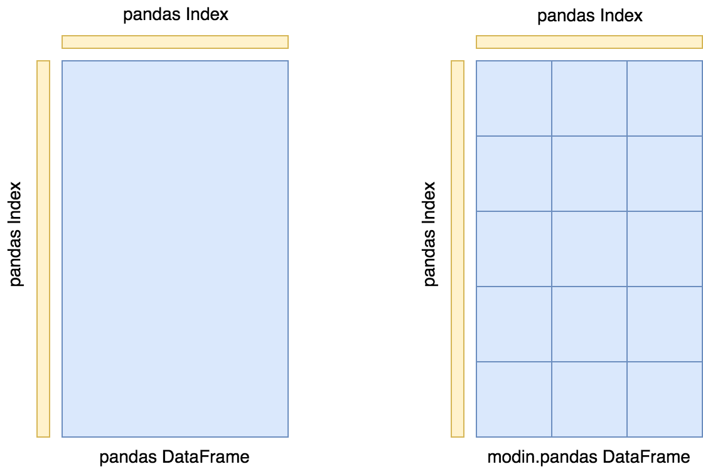
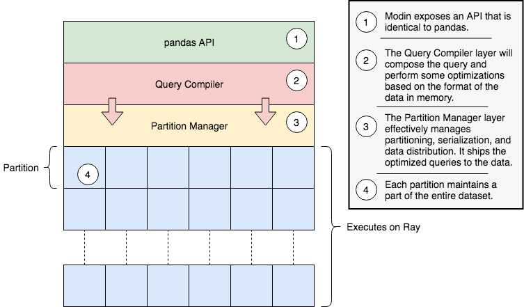

Architecture
============

In this documentation page, we will lay out the overall architecture for Modin, as well
as go into detail about the implementation and other important details. This document
also contains important reference information for those interested in contributing new
functionality, bugfixes, and enhancements.

DataFrame Partitioning
----------------------

The Modin DataFrame architecture follows in the footsteps of modern architectures for
database and high performance matrix systems. We chose a partitioning schema that
partitions along both columns and rows because it gives Modin flexibility and
scalability in both the number of columns and the number of rows supported. The
following figure illustrates this concept.

Currently, each partition's memory format is a `pandas DataFrame`_. In the future, we will
support additional in-memory formats for the backend, namely `Arrow tables`_.

Index
"""""

We currently use the ``pandas.Index`` object for both indexing columns and rows. In the
future, we will implement a distributed, pandas-compatible Index object in order remove
this scaling limitation from the system. It does not start to become a problem until you
are operating on more than 10's of billions of columns or rows, so most workloads will
not be affected by this scalability limit. **Important note**: If you are using the
default index (``pandas.RangeIndex``) there is a fixed memory overhead (~200 bytes) and
there will be no scalability issues with the index.

System Architecture
-------------------

The figure below outlines the general architecture for the implementation of Modin.

Modin is logically separated into different layers that represent the hierarchy of a
typical Database Management System. At the highest layer, we expose the pandas API. This
is discussed in many other parts of the documentation, so we will not go into detail for
it here. We will go through all of the other components in some detail below, starting
with the next highest layer, the Query Compiler.

Query Compiler
""""""""""""""

The Query Compiler receives queries from the pandas API layer. The API layer's
responsibility is to ensure clean input to the Query Compiler. The Query Compiler must
have knowledge of the in-memory format of the data (currently a pandas DataFrame) in
order to efficiently compile the queries.

The Query Compiler is responsible for sending the compiled query to the Partition
Management layer. In this design, the Query Compiler does not need to know what the
execution framework is (Ray_ in this case), and gives the control of the partition
layout to a lower layer.

At this layer, operations can be performed lazily. Currently, Modin executes most
operations eagerly in an attempt to behave as pandas does. Some operations, e.g.
``transpose`` are expensive and create full copies of the data in-memory. In these
cases, we keep some metadata about the operations and queue them up so they are somewhat
lazy. In the future, we plan to add additional query planning and laziness to Modin to
ensure that queries are performed efficiently.

Partition Manager
"""""""""""""""""

The Partition Manager is responsible for the data layout and shuffling, partitioning,
and serializing the tasks that get sent to each partition.

The Partition Manager can change the size and shape of the partitions based on the type
of operation. For example, certain operations are complex and require access to an
entire column or row. The Partition Manager can convert the block partitions to row
partitions or column partitions. This gives Modin the flexibility to perform operations
that are difficult in row-only or column-only partitioning schemas.

Another important component of the Partition Manager is the serialization and shipment
of compiled queries to the Partitions. It maintains metadata for the length and width of
each partition, so when operations only need to operate on or extract a subset of the
data, it can ship those queries directly to the correct partition. This is particularly
important for some operations in pandas which can accept different arguments and
operations for different columns, e.g. ``fillna`` with a dictionary.

Partition
"""""""""

Partitions are responsible for managing a subset of the DataFrame. As is mentioned
above, the DataFrame is partitioned both row and column-wise. This gives Modin
scalability in both directions and flexibility in data layout. There are a number of
optimizations in Modin that are implemented in the partitions. Partitions are specific
to the execution framework and in-memory format of the data. This allows Modin to
exploit potential optimizations across both of these. These optimizations are explained
further on the pages specific to the execution framework.

Supported Execution Frameworks and Memory Formats
"""""""""""""""""""""""""""""""""""""""""""""""""

This is the list of execution frameworks and memory formats supported in Modin. If you
would like to contribute a new execution framework or memory format, please see the
documentation page on Contributing_.

- `Pandas on Ray`_
    - Uses the Ray_ execution framework.
    - The in-memory format is a pandas DataFrame.
- Coming Soon...

.. _pandas Dataframe: https://pandas.pydata.org/pandas-docs/version/0.23.4/generated/pandas.DataFrame.html
.. _Arrow tables: https://arrow.apache.org/docs/python/generated/pyarrow.Table.html
.. _Ray: https://github.com/ray-project/ray
.. _Contributing: contributing.html
.. _Pandas on Ray: pandas_on_ray.html
