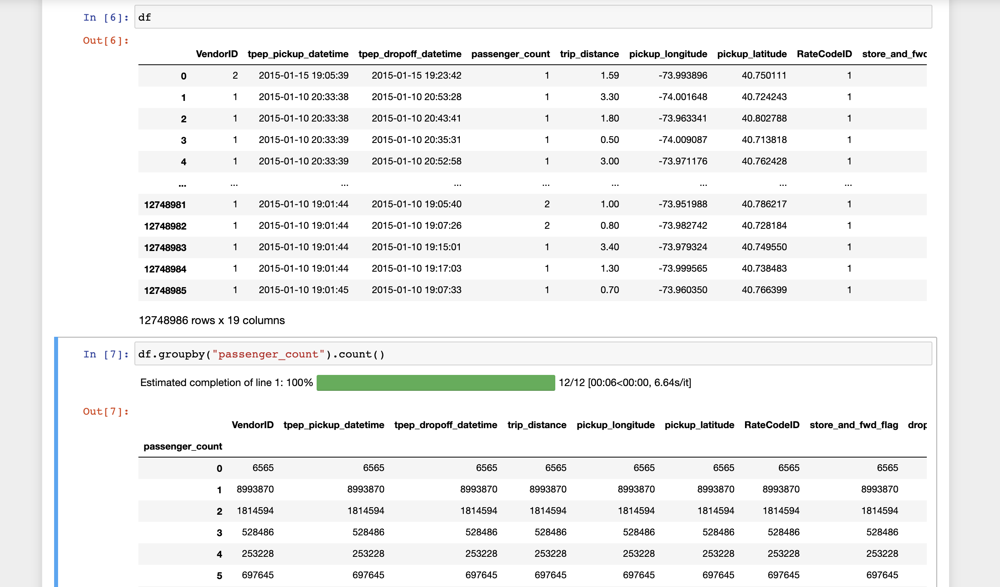

Overview
========
Modin aims to not only optimize Pandas, but also provide a comprehensive, 
integrated toolkit for data scientists. We are actively developing data science tools 
such as DataFrame - spreadsheet integration, DataFrame algebra, progress bars, SQL queries
on DataFrames, and more. Please feel free to contact us anytime for the latest updates!

Modin Spreadsheets API: Render Dataframes as Spreadsheets
---------------------------------------------------------
The Spreadsheet API for Modin allows you to render the dataframe as a spreadsheet to easily explore 
your data and perform operations on a graphical user interface. The API also includes features for recording 
the changes made to the dataframe and exporting them as reproducible code. Built on top of Modin and SlickGrid, 
the spreadsheet interface is able to provide interactive response times even at a scale of billions of rows. 
See our `Modin Spreadsheet API documentation`_ for more details.

.. figure:: ../img/modin_spreadsheet_mini_demo.gif
   :align: center
   :width: 650px
   :height: 350px   

Progress Bar
------------
Visual progress bar for Dataframe operations such as groupby and fillna, as well as for file reading operations such as 
read_csv. Built using the tqdm library and Ray execution engine. See `Progress Bar documentation`_ for more details.

Dataframe Algebra
-----------------
A minimal set of operators that can be composed to express any dataframe query for use in query planning and optimization.
See our `paper`_ for more information, and full documentation is coming soon!

SQL on Modin Dataframes
------------------------

.. figure:: ../img/modin_sql_example.png
   :align: center   

Read about Modin Dataframe support for SQL queries in this recent `blog post`_. Check out the `Modin SQL documentation`_ as well!

.. _`blog post`: https://medium.com/riselab/why-every-data-scientist-using-pandas-needs-modin-bringing-sql-to-dataframes-3b216b29a7c0
.. _`Modin SQL documentation`: /modin_sql.html
.. _`Modin Spreadsheet API documentation`: /spreadsheets_api.html
.. _`Progress Bar documentation`: /progress_bar.html
.. _`Paper`: https://arxiv.org/pdf/2001.00888.pdf
