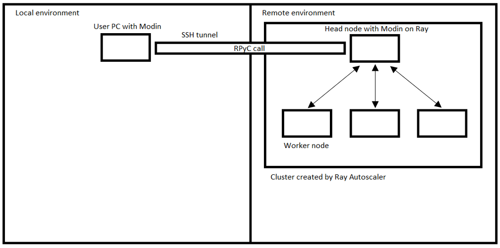

Modin in the Cloud
==================

Modin implements functionality that allows to transfer computing to the cloud with minimal effort.
Please note that this feature is experimental and behavior or interfaces could be changed.

Prerequisites
"""""""""""""

  * Sign up with a cloud provider and get credentials file. Note that we supported only AWS currently, more are planned.
  (For AWS, on credentials file format see https://docs.aws.amazon.com/cli/latest/userguide/cli-configure-files.html#cli-configure-files-where)

Setup environment
"""""""""""""""""
pip install modin[remote] - which install the following dependencies:
  * RPyC - https://github.com/tomerfiliba-org/rpyc
  Allows to perform remote procedure calls.
  * Cloudpickle - https://github.com/cloudpipe/cloudpickle
  Allows pickling of functions and classes, which is used in our distributed runtime.
  * Boto3 - https://github.com/boto/boto3
  Allows to create and setup AWS cloud machines. Optional library for Ray Autoscaler.

It also needs Ray Autoscaler component, which is implicitly installed with Ray (note that Ray from ``conda`` is now missing that component!).
More information in https://docs.ray.io/en/releases-0.8.2/autoscaling.html#automatic-cluster-setup.

Architecture
""""""""""""

Notes:
  * To get maximum performance, you need to try to reduce the amount of data transferred between local and remote environments as much as possible.
  * To ensure correct operation, it is necessary to ensure the equivalence of versions of all Python libraries (including the interpreter) in the local and remote environments.

Public interface
""""""""""""""""

.. automodule:: modin.experimental.cloud
  :members:

Usage examples
""""""""""""""

.. code-block:: python

  """
  This is a very basic sample script for running things remotely.
  It requires `aws_credentials` file to be present in current working directory.
  On credentials file format see https://docs.aws.amazon.com/cli/latest/userguide/cli-configure-files.html#cli-configure-files-where
  """
  import logging
  import modin.pandas as pd
  from modin.experimental.cloud import cluster
  # set up verbose logging so Ray autoscaler would print a lot of things
  # and we'll see that stuff is alive and kicking
  logging.basicConfig(format="%(asctime)s %(message)s")
  logger = logging.getLogger()
  logger.setLevel(logging.DEBUG)
  example_cluster = cluster.create("aws", "aws_credentials")
  with example_cluster:
      remote_df = pd.DataFrame([1, 2, 3, 4])
      print(len(remote_df))  # len() is executed remotely

Some more examples can be found in `examples\cluster` folder.
