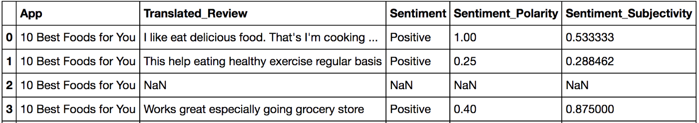

SQL on Modin Dataframes
=======================

MindsDB_ has teamed up with Modin to bring in-memory SQL to distributed Modin Dataframes. 
Now you can run SQL alongside the pandas API without copying or going through your disk. 
What this means is that you can now have a SQL solution that you can seamlessly scale 
horizontally and vertically, by leveraging the incredible power of Ray.

A Short Example Using the Google Play Store
""""""""""""""""""""""""""""""""""""""""""""

.. code-block:: python

    import modin.pandas as pd
    import modin.experimental.sql as sql

    # read google play app store list from csv
    gstore_apps_df = pd.read_csv("https://tinyurl.com/googleplaystorecsv")

.. figure:: ../img/modin_sql_google_play_table.png
    :align: center 

Imagine that you want to quickly select from ‘gstore_apps_df’ the columns 
App, Category, and Rating, where Price is ‘0’.

.. code-block:: python

    # You can then define the query that you want to perform
    sql_str = "SELECT App, Category, Rating FROM gstore_apps WHERE Price = '0'"

    # And simply apply that query to a dataframe
    result_df = sql.query(sql_str, gstore_apps=gstore_apps_df)

    # Or, in this case, where the query only requires one table, 
    # you can also ignore the FROM part in the query string:
    query_str = "SELECT App, Category, Rating WHERE Price = '0' "

    # sql.query can take query strings without FROM statement 
    # you can specify from as the function argument
    result_df = sql.query(query_str, from=gstore_apps_df)

Writing Complex Queries
"""""""""""""""""""""""

Let's explore a more complicated example. 

.. code-block:: python

    gstore_reviews_df = pd.read_csv("https://tinyurl.com/gstorereviewscsv")

Say we want to retrieve the top 10 app categories ranked by best average ‘sentiment_polarity’ where the 
average ‘sentiment_subjectivity’ is less than 0.5.

Since ‘Category’ is on the **gstore_apps_df** and sentiment_polarity is on **gstore_reviews_df**, 
we need to join the two tables, and operate averages on that join.

.. code-block:: python

    # Single query with join and group by
    sql_str = """
    SELECT 
    category, 
    avg(sentiment_polarity) as avg_sentiment_polarity, 
    avg(sentiment_subjectivity) as avg_sentiment_subjectivity
    FROM (
    SELECT 
        category, 
        CAST(sentiment as float) as sentiment, 
        CAST(sentiment_polarity as float) as sentiment_polarity
    FROM gstore_apps_df 
        INNER JOIN gstore_reviews_df
        ON gstore_apps_df.app = gstore_reviews_df.app
    ) sub
    GROUP BY category
    HAVING avg_sentiment_subjectivity < 0.5
    ORDER BY avg_sentiment_polarity DESC
    LIMIT 10
    """

    # Run query using apps and reviews dataframes, 
    # NOTE: that you simply pass the names of the tables in the query as arguments

    result_df = sql.query( sql_str, 
                            gstore_apps_df = gstore_apps_df, 
                            gstore_reviews_df = gstore_reviews_df)

Or, you can bring the best of doing this in python and run the query in multiple parts (it’s up to you). 

.. code-block:: python

    # join the items and reviews

    result_df = sql.query( """ 
    SELECT 
        category, 
        sentiment, 
        sentiment_polarity 
    FROM gstore_apps_df INNER JOIN gstore_reviews_df 
    ON gstore_apps_df.app = gstore_reviews_df.app """, 
    gstore_apps_df = gstore_apps_df, 
    gstore_reviews_df = gstore_reviews_df )

    # group by category and calculate averages

    result_df = sql.query( """
    SELECT 
        category, 
        avg(sentiment_polarity) as avg_sentiment_polarity, 
        avg(sentiment_subjectivity) as avg_sentiment_subjectivity 
    GROUP BY category
    HAVING CAST(avg_sentiment_subjectivity as float) < 0.5
    ORDER BY avg_sentiment_polarity DESC
    LIMIT 10""", 
    from = result_df)

If you have a cluster or even a computer with more than one CPU core, 
you can write SQL and Modin will run those queries in a distributed and optimized way. 

Further Examples and Full Documentation
"""""""""""""""""""""""""""""""""""""""
In the meantime, you can check out our `Example Notebook`_ that contains more 
examples and ideas, as well as this blog_ explaining Modin SQL usage.

.. _MindsDB: https://mindsdb.com/
.. _Example Notebook: https://github.com/mindsdb/dfsql/blob/stable/testdrive.ipynb
.. _blog: https://medium.com/riselab/why-every-data-scientist-using-pandas-needs-modin-bringing-sql-to-dataframes-3b216b29a7c0
