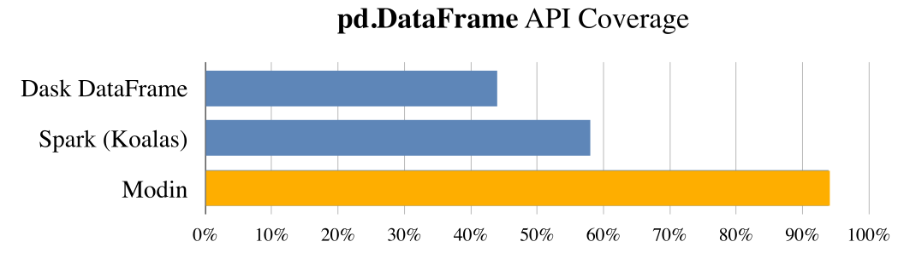

Modin vs. Dask DataFrame
========================

Dask's DataFrame is effectively a meta-frame, partitioning and scheduling many smaller
``pandas.DataFrame`` objects. The Dask DataFrame does not implement the entire pandas
API. 

| **TLDR: Modin's API is identical to pandas, whereas Dask's is not.**
| **Note: The projects are fundamentally different in their aims, so a fair comparison is challenging.**

API
---

The APIs of Modin and Dask DataFrame are different in several ways, explained here.

Dask DataFrame
""""""""""""""

Missing API support
___________________

Dask is currently missing multiple APIs from pandas that Modin supports. In particular,
Dask does not implement ``iloc``, ``MultiIndex``, ``apply(axis=0)``, ``quantile``
(approximate quantile is available), ``median``, and more. Some of these APIs cannot be
implemented efficiently or at all given the architecture design tradeoffs made in Dask's
implementation, and others simply require engineering effort. ``iloc``, for example, can
be implemented, but it would be inefficient, and column-wise operations such as ``apply(axis=0)`` 
would be impossible to implement in Dask's architecture.

Delayed Computation
___________________

Dask DataFrame makes use of lazy evaluation, which means that the computation is delayed until users explicitly evaluate the results. This mode of evaluation places a lot of optimization responsibility on the user. Specifically, Dask DataFrame's API differs from pandas in that it requires users to explicitly call ``.compute()`` to materialize the result of the DataFrame computation. The need to explicitly trigger computation makes the API less convenient to work with, but allows Dask to perform holistic optimizations over the entire dataflow graph.

Non-order preserving
_____________________
By default, pandas preserves the order of the DataFrame, so that users can expect a
consistent, ordered view as they are operating on their DataFrame. However, Dask makes no
guarantees about the order of rows in the DataFrame. This is because Dask sorts the 
``index`` for optimization purposes to speed up computations that involve the row index, as 
a result, it can not support user-specified order.

Modin
"""""

Comprehensive API support
_________________________

Modin is targeted toward parallelizing the entire pandas API and currently implements `more than 90% <https://github.com/modin-project/modin#pandas-api-coverage>`_ of the pandas API. Modin acts as a drop-in replacement for pandas, such that even if the API is not yet
supported, it still works by falling back to running pandas. One of the key features
of being a drop-in replacement is that not only will it work for existing code, if a
user wishes to go back to running pandas directly, they are not locked in to using Modin and can switch between Modin and pandas at no cost. In other words, Modin notebooks can be converted to and from pandas as the user desires.

Eager evaluation
________________

Eager evaluation is the default mode of operation for data scientists when working with pandas DataFrames in an interactive environment, such as Jupyter Notebooks. Modin reproduces this familiar behavior by performing all computations as soon as it is issued, so that users can inspect intermediate results and quickly see the results of their computations without having to wait or explicitly trigger computation. This is especially useful during interactive data analysis, where users often iterate on their DataFrame workflows or build up their DataFrame queries in an incremental fashion. Modin also supports lazy evaluation via the OmniSci engine, you can learn more about it :doc:`here </flow/modin/experimental/core/execution/native/implementations/omnisci_on_native/index>`.

Order preserving
________________
Modin reproduces the intuitive behavior in pandas where the order of the DataFrame is preserved. Enforcing ordering on a parallel dataframe system like Modin requires non-trivial effort that involves decoupling of the logical and physical representation of the data underneath the hoods. Modin abstracts away the physical representation of the data and provides an ordered view that is consistent with user's expectations.

Advanced: Architecture
----------------------

The key differences in Modin and Dask's architectures are explained in this section.

Dask DataFrame
""""""""""""""

Row-oriented Partitioning
_________________________

Similar to Spark, Dask DataFrame uses row-based partitioning, as explained in their
`documentation`_. Dask DataFrame also uses a custom index object for indexing into the object,
which is not compatible with pandas. Dask DataFrame treats operations on the
DataFrame like MapReduce operations, which allows them to parallelize a subset of the pandas
API, but makes certain pandas operations impossible.

Modin
"""""

Flexible Partitioning
_____________________

Modin's implementation is grounded in theory, which is what enables us to implement the
entire pandas API. Modin's employs a flexible partitioning scheme that allows the system 
to scale along both row and column directions. This is explained at a high level in `Modin's
documentation`_. Due to the finer-grained control over the partitioning, Modin can support 
a number of operations that are very challenging to parallelize in MapReduce-based systems (e.g.,
``transpose``, ``median``, ``quantile``). This flexibility in partitioning also gives Modin
tremendous power to implement efficient straggler mitigation and improve 
utilization over the entire cluster.

Modular Design
______________
Modin's highly modular design is architected to run on a variety of systems. 
The goal for the extensible design is that users can take the same notebook seamlessly move between different clusters and environments and Modin can run on what you have. Currently, Modin support running on Dask's compute engine in addition to Ray. The modular design makes it easier for developers to different execution engines or compile to different memory formats. Modin can run on a Dask cluster in the same way that Dask DataFrame can, but they differ in all of the ways described above.

In the long-term, Modin will become a data science framework that supports popular APIs (SQL, pandas, etc.) while leveraging the same underlying execution. Modin's flexible architecture also means that as the `pandas API continues to evolve <https://data-apis.org/blog/announcing_the_consortium/>`_, Modin can quickly move towards supporting new versions of the pandas API.

.. _documentation: http://docs.dask.org/en/latest/DataFrame.html#design.
.. _Modin's documentation: https://modin.readthedocs.io/en/latest/developer/architecture.html
