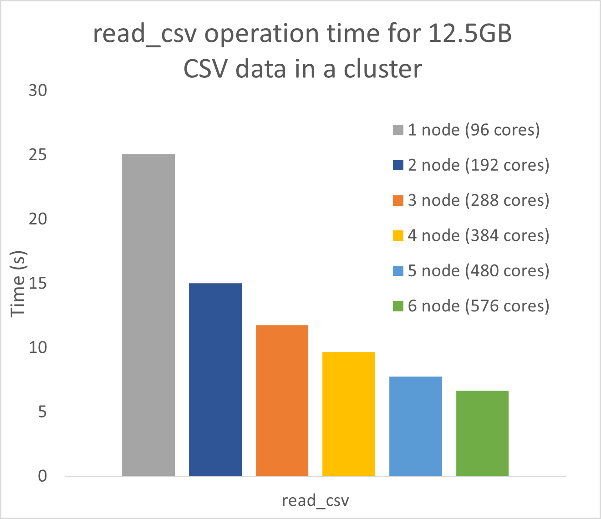

========================
Using Modin in a Cluster
========================

.. note::
  | *Estimated Reading Time: 15 minutes*
  | You can follow along in a Jupyter notebook in this two-part tutorial:  [`Part 1 <https://github.com/modin-project/modin/tree/master/examples/tutorial/jupyter/execution/pandas_on_ray/cluster/exercise_5.ipynb>`_], [`Part 2 <https://github.com/modin-project/modin/tree/master/examples/tutorial/jupyter/execution/pandas_on_ray/cluster/exercise_6.ipynb>`_].

Often in practice we have a need to exceed the capabilities of a single machine. Modin
works and performs well in both local mode and in a cluster environment. The key
advantage of Modin is that your notebook does not change between local development and
cluster execution. Users are not required to think about how many workers exist or how
to distribute and partition their data; Modin handles all of this seamlessly and
transparently.

Starting up a Ray Cluster
-------------------------
Modin is able to utilize Ray's built-in autoscaled cluster. To launch a Ray cluster using Amazon Web Service (AWS), you can use `this file <https://github.com/modin-project/modin/blob/master/examples/tutorial/jupyter/execution/pandas_on_ray/cluster/modin-cluster.yaml>`_
as the config file.

.. code-block:: bash

   pip install boto3
   aws configure

To start up the Ray cluster, run the following command in your terminal:

.. code-block:: bash

   ray up modin-cluster.yaml

This configuration script starts 1 head node (m5.24xlarge) and 7 workers (m5.24xlarge),
768 total CPUs. For more information on how to launch a Ray cluster across different
cloud providers or on-premise, you can also refer to the Ray documentation `here <https://docs.ray.io/en/latest/cluster/cloud.html>`_.

Connecting to a Ray Cluster
---------------------------

To connect to the Ray cluster, run the following command in your terminal:

.. code-block:: bash

   ray attach modin-cluster.yaml

The following code checks that the Ray cluster is properly configured and attached to
Modin:

.. code-block:: python

   import ray
   ray.init(address="auto")
   from modin.config import NPartitions
   assert NPartitions.get() == 768, "Not all Ray nodes are started up yet"
   ray.shutdown()

Congratualions! You have successfully connected to the Ray cluster.
See more on the :doc:`Modin in the Cloud </usage_guide/advanced_usage/modin_in_the_cloud>`
documentation page.

Using Modin on a Ray Cluster
----------------------------

Now that we have a Ray cluster up and running, we can use Modin to perform pandas
operation as if we were working with pandas on a single machine. We test Modin's
performance on the 1.8GB `NYC Taxi dataset <https://s3.amazonaws.com/dask-data/nyc-taxi/2015/yellow_tripdata_2015-01.csv>`_ that was provided as part of our `cluster setup script <https://github.com/modin-project/modin/blob/master/examples/tutorial/jupyter/execution/pandas_on_ray/cluster/modin-cluster.yaml>`_. We can time the following operation
in a Jupyter notebook:

.. code-block:: python

   %%time
   df = pd.read_csv("big_yellow.csv", quoting=3)

   %%time
   count_result = df.count()

   %%time
   groupby_result = df.groupby("passenger_count").count()

   %%time
   apply_result = df.applymap(str)

Modin performance scales as the number of nodes and cores increases. The following
chart shows the performance of the above operations with 2, 4, and 8 nodes, with
improvements in performance as we increase the number of resources Modin can use.

Advanced: Configuring your Ray Environment
------------------------------------------

In some cases, it may be useful to customize your Ray environment. Below, we have listed
a few ways you can solve common problems in data management with Modin by customizing
your Ray environment. It is possible to use any of Ray's initialization parameters,
which are all found in `Ray's documentation`_.

.. code-block:: python

   import ray
   ray.init()
   import modin.pandas as pd

Modin will automatically connect to the Ray instance that is already running. This way,
you can customize your Ray environment for use in Modin!

.. _`DataFrame`: https://pandas.pydata.org/pandas-docs/stable/reference/api/pandas.DataFrame.html
.. _`pandas`: https://pandas.pydata.org/pandas-docs/stable/
.. _`open an issue`: https://github.com/modin-project/modin/issues
.. _`Ray's documentation`: https://ray.readthedocs.io/en/latest/api.html
