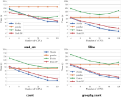

Modin vs. Dask DataFrame vs. Koalas
===================================

Libraries such as `Dask DataFrame <https://docs.dask.org/en/stable/dataframe.html>`_ (DaskDF for short) and `Koalas <https://koalas.readthedocs.io/en/latest/>`_ aim to support the pandas API on top of distributed computing frameworks, Dask and Spark respectively. Instead, Modin aims to preserve the pandas API and behavior as is, while abstracting away the details of the distributed computing framework underneath. Thus, the aims of these libraries are fundamentally different.

Specifically, Modin enables pandas-like

* row and column-parallel operations, unlike DaskDF and Koalas that only support row-parallel operations
* indexing & ordering semantics, unlike DaskDF and Koalas that deviate from these semantics
* eager execution, unlike DaskDF and Koalas that provide lazy execution

As a result, Modin's coverage is `more than 90% <https://github.com/modin-project/modin#pandas-api-coverage>`_ of the pandas API, while DaskDF and Koalas' coverage is about 55%. 

.. figure:: ../../img/api_coverage_comparison.svg
   :align: center
   :alt: Percentage coverage of the pandas API after deduplication

For more technical details please see our VLDB 2022 research paper, referenced `here <https://people.eecs.berkeley.edu/~totemtang/paper/Modin.pdf>`_. 

Brief Overview of DaskDF and Koalas
-----------------------------------

Dask's `DataFrame <https://docs.dask.org/en/stable/dataframe.html>`_ (DaskDF) is effectively a meta-DataFrame, partitioning and scheduling many smaller ``pandas.DataFrame`` objects. Users construct a task graph of dataframe computation step by step and then trigger computation using the ``compute`` function.

Spark's `Koalas <https://koalas.readthedocs.io/en/latest/>`_ provides the pandas API on Spark, leveraging the preexisting Spark SQL optimizer to execute select pandas commands. Like DaskDF, Koalas also employs lazy computation, only triggering computation when the user requests to see the results.

Partitioning and Parallelization
--------------------------------

Modin, DaskDF, Koalas are all examples of parallel dataframe systems. Parallelism is achieved by partitioning a large dataframe into smaller ones that can be operated on in parallel. As a result, the partitioning scheme chosen by the system dictates the pandas functions that can or can not be supported.

**DaskDF and Koalas only support row-oriented partitioning and parallelism.** This approach is analogous to relational databases. The dataframe is conceptually broken down into horizontal partitions along rows, where each partition is independently processed if possible. When DaskDF or Koalas are required to perform column-parallel operations that to be done on columns independently (e.g., dropping columns with null values via ``dropna`` on the column ``axis``), they either perform very poorly with no parallelism or do not support that operation.

**Modin supports both row, column, and cell-oriented partitioning and parallelism**. That is, the dataframe can be conceptually broken down as groups of rows, groups of columns, or both groups of rows and groups of columns (effectively a block or sub-matrix). Modin will transparently reshape the partitioning as necessary for the corresponding operation, based on whether the operation is row-parallel, column-parallel, or cell-parallel (independently applied to each unit cell). This allows Modin to support more of the pandas API and do so efficiently. Due to the finer-grained control over the partitioning, Modin can support a number of operations that are very challenging to parallelize in row-oriented systems (e.g., ``transpose``, ``median``, ``quantile``). This flexibility in partitioning also gives Modin tremendous power to implement efficient straggler mitigation and improve utilization over the entire cluster.

API Coverage
------------

One of the key benefits of pandas is its versatility, due to the wide array of operations, with more than 600+ API operations for data cleaning, feature engineering, data transformation, data summarization, data exploration, and machine learning. However, it is not trivial to develop scalable implementations of each of these operations in a dataframe system.
**DaskDF and Koalas only implements about** `55%  <https://arxiv.org/abs/2001.00888>`_ **of the pandas API**; they do not implement certain APIs that would deviate from the row-wise partitioning approach, or would be inefficient with the row-wise parallelization. For example, Dask does not implement ``iloc``, ``MultiIndex``, ``apply(axis=0)``, ``quantile`` (only approximate quantile is available), ``median``, and more. Given DaskDF's row-oriented architecture, ``iloc``, for example, can technically be implemented, but it would be inefficient, and column-wise operations such as ``apply(axis=0)`` would be impossible to implement. Similarly, Koalas does not implement ``apply(axis=0)`` (it only applies the function per row partition, giving a different result), ``quantile``, ``median`` (only approximate quantile/median is available), ``MultiIndex``, ``combine``, ``compare`` and more.

**Modin supports all of the above pandas API functions, as well as others, with** `more than 90% <https://github.com/modin-project/modin#pandas-api-coverage>`_ **coverage of the pandas API.**  Modin additionally acts as a drop-in replacement for pandas, such that even if the API is not yet supported, it still works by falling back to running vanilla pandas. One of the key features of being a drop-in replacement is that not only will it work for existing code, if a user wishes to go back to running pandas directly, they are not locked in to using Modin and can switch between Modin and pandas at no cost. In other words, scripts and notebooks written in Modin can be converted to and from pandas as the user desires by simply replacing the import statement.

Execution Semantics
---------------------

**DaskDF and Koalas make use of lazy evaluation, which means that the computation is delayed until users explicitly evaluate the results.** This mode of evaluation places a lot of optimization responsibility on the user, forcing them to think about when it would be useful to inspect the intermediate results or delay doing so. Specifically, DaskDF's API differs from pandas in that it requires users to explicitly call ``.compute()`` to materialize the result of the computation. Often if that computation corresponds to a long chain of operators, this call can take a very long time to execute. Overall, the need to explicitly trigger computation makes the API less convenient to work with, but gives DaskDF and Koalas the opportunity to perform holistic optimizations over the entire dataflow graph. However, to the best of our knowledge, neither DaskDF nor Koalas actually leverage holistic optimizations.

**Modin employs eager evaluation, like pandas.** Eager evaluation is the default mode of operation for data scientists when working with pandas in an interactive environment, such as Jupyter Notebooks. Modin reproduces this familiar behavior by performing all computations eagerly as soon as it is issued, so that users can inspect intermediate results and quickly see the results of their computations without having to wait or explicitly trigger computation. This is especially useful during interactive data analysis, where users often iterate on their dataframe workflows or build up their dataframe queries in an incremental fashion. We also have developed techniques for `opportunistic evaluation <https://arxiv.org/pdf/2103.02145.pdf>`_ that bridges the gap between lazy and eager evaluation that will be incorporated in Modin in the future.

Ordering Semantics
------------------

By default, pandas preserves the order of the dataframe, so that users can expect a consistent, ordered view as they are operating on their dataframe. 

**Both DaskDF and Koalas make no guarantees about the order of rows in the DataFrame.**  This is because DaskDF sorts the ``index`` for optimization purposes to speed up computations that involve the row index; and as a result, it does not support user-specified order. Likewise, Koalas `does not support ordering <https://koalas.readthedocs.io/en/latest/whatsnew/v0.27.0.html#head-ordering>`_ by default because it will lead to a performance overhead when operating on distributed datasets. 

**DaskDF additionally does not support multi-indexing or sorting.** 
DaskDF sorts the data based on a single set of row labels for fast row lookups, and builds an indexing structure based on these row labels. Data is both logically and physically stored in the same order. As a result, DaskDF does not support a `sort` function.

**Modin reproduces the intuitive behavior in pandas where the order of the DataFrame is preserved, and supports multi-indexing.** Enforcing ordering on a parallel dataframe system like Modin requires non-trivial effort that involves decoupling of the logical and physical representation of the data, enabling the order to be lazily kept up-to-date, but eagerly computed based on user needs (See Section 4.2 in `our recent paper <https://people.eecs.berkeley.edu/~totemtang/paper/Modin.pdf>`_). Modin abstracts away the physical representation of the data and provides an ordered view that is consistent with user's expectations.

Compatibility with Computational Frameworks
-------------------------------------------

**DaskDF and Koalas are meant to be run on Dask and Spark respectively.** They are highly tuned to the corresponding frameworks, and cannot be ported to other computational frameworks.

**Modin's highly modular design is architected to run on a variety of systems, and support a variety of APIs.** The goal for the extensible design is that users can take the same notebook or script and seamlessly move between different clusters and environments, with Modin being able to support the pandas API on your preexisting infrastructure. Currently, Modin support running on Dask's compute engine in addition to Ray. The modular design makes it easier for developers to different execution engines or compile to different memory formats. Modin can run on a Dask cluster in the same way that DaskDF can, but they differ in the ways described above. In addition, Modin is continually expanding to support popular data processing APIs (SQL in addition to pandas, among other DSLs for data processing) while leveraging the same underlying execution framework. Modin's flexible architecture also means that as the `pandas API continues to evolve <https://data-apis.org/blog/announcing_the_consortium/>`_, Modin can quickly move towards supporting new versions of the pandas API.

Performance Comparison
----------------------

**On operations supported by all systems, Modin provides substantial speedups.** Thanks to its optimized design, Modin is able to take advantage of multiple cores relative to both Koalas and DaskDF to efficiently execute pandas operations. It is notable that Koalas is often slower than pandas, due to the overhead of Spark. 

**Modin provides substantial speedups even on operators not supported by other systems.** Thanks to its flexible partitioning schemes that enable it to support the vast majority of pandas operations — be it row, column, or cell-oriented - Modin provides benefits on operations such as ``join``, ``median``, and ``infer_types``. While Koalas performs ``join`` slower than Pandas, Dask failed to support ``join`` on more than 20M rows, likely due poor support for `shuffles <https://coiled.io/blog/better-shuffling-in-dask-a-proof-of-concept/>`_. Details of the benchmark and additional join experiments can be found in `our paper <https://people.eecs.berkeley.edu/~totemtang/paper/Modin.pdf>`_.

.. _documentation: http://docs.dask.org/en/latest/DataFrame.html#design.
.. _Modin's documentation: https://modin.readthedocs.io/en/latest/development/architecture.html
