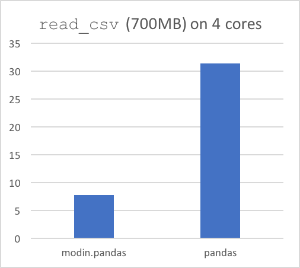

.. image:: img/MODIN_ver2_hrz.png
   :width: 400px
   :alt: modin logo
   :align: center

====

*Scale your pandas workflows by changing one line of code*

.. raw:: html

    
<b>To use Modin, replace the pandas import:</b>

.. code-block:: python

  # import pandas as pd
  import modin.pandas as pd

Scale your pandas workflow by changing a single line of code.
-------------------------------------------------------------

Modin uses Ray_ to provide an effortless way to speed up your pandas notebooks, scripts,
and libraries. Unlike other distributed DataFrame libraries, Modin provides seamless
integration and compatibility with existing pandas code. Even using the DataFrame
constructor is identical.

.. code-block:: python

  import modin.pandas as pd
  import numpy as np

  frame_data = np.random.randint(0, 100, size=(2**10, 2**8))
  df = pd.DataFrame(frame_data)

To use Modin, you do not need to know how many cores your system has and you do not need
to  specify how to distribute the data. In fact, you can continue using your previous
pandas notebooks while experiencing a considerable speedup from Modin, even on a single
machine. Once you’ve changed your import statement, you’re ready to use Modin just like
you would pandas.

Faster pandas, even on your laptop
----------------------------------

The ``modin.pandas`` `DataFrame`_ is an extremely light-weight parallel DataFrame. Modin
transparently distributes the data and computation so that all you need to do is
continue using the pandas API as you were before installing Modin. Unlike other parallel
DataFrame systems, Modin is an extremely light-weight, robust DataFrame. Because it is so
light-weight, Modin provides speed-ups of up to 4x on a laptop with 4 physical cores.

In pandas, you are only able to use one core at a time when you are doing computation of
any kind. With Modin, you are able to use all of the CPU cores on your machine. Even in
``read_csv``, we see large gains by efficiently distributing the work across your entire
machine.

.. code-block:: python

  import modin.pandas as pd

  df = pd.read_csv("my_dataset.csv")

Modin is a DataFrame for datasets from 1KB to 1TB+
--------------------------------------------------

We have focused heavily on bridging the solutions between DataFrames for small data
(e.g. pandas) and large data. Often data scientists require different tools for doing
the same thing on different sizes of data. The DataFrame solutions that exist for 1KB do
not scale to 1TB+, and the overheads of the solutions for 1TB+ are too costly for
datasets in the 1KB range. With Modin, because of its light-weight, robust, and scalable
nature, you get a fast DataFrame at 1KB and 1TB+.

**Modin is currently under active development. Requests and contributions are welcome!**

.. toctree::
   :caption: Installation
   :numbered:

   installation

.. toctree::
   :caption: Using Modin
   :numbered:

   using_modin
   out_of_core
   pandas_supported

.. toctree::
   :caption: Using Pandas on Ray
   :numbered:

   UsingPandasonRay/index
   UsingPandasonRay/dataframe_supported
   UsingPandasonRay/series_supported
   UsingPandasonRay/utilities_supported
   UsingPandasonRay/io_supported
   UsingPandasonRay/optimizations

.. toctree::
   :caption: Using Pandas on Dask
   :numbered:

   UsingPandasonDask/index
   UsingPandasonDask/optimizations

.. toctree::
   :caption: Using Pyarrow on Ray (Experimental)
   :numbered:

   UsingPyarrowonRay/index

.. toctree::
   :caption: Using SQL on Ray
   :numbered:

   UsingSQLonRay/index

.. toctree::
   :caption: Contributing to Modin
   :numbered:

   contributing
   architecture

.. toctree::
   :caption: Help
   :numbered:

   troubleshooting
   contact

.. _Dataframe: https://pandas.pydata.org/pandas-docs/version/0.23.4/generated/pandas.DataFrame.html
.. _Ray: https://github.com/ray-project/ray/
