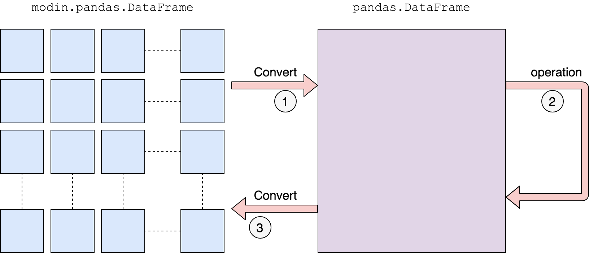

Modin Supported Methods
=======================

For your convenience, we have compiled a list of currently implemented APIs and methods
available in Modin. This documentation is updated as new methods and APIs are merged
into the master branch, and not necessarily correct as of the most recent release. In
order to install the latest version of Modin, follow the directions found on the
`installation page`_.

To see these lists, please visit the pages for your interested engine/backend
combination:

* `Pandas on Ray`_
* `Pandas on Dask`_
* `Pyarrow on Ray`_

Questions on implementation details
-----------------------------------

If you have a question about the implementation details or would like more information
about an API or method in Modin, please contact the Modin `developer mailing list`_.

Defaulting to pandas
--------------------

The remaining unimplemented methods default to pandas. This allows users to continue
using Modin even though their workloads contain functions not yet implemented in Modin.
Here is a diagram of how we convert to pandas and perform the operation:

We first convert to a pandas DataFrame, then perform the operation. There is a
performance penalty for going from a partitioned Modin DataFrame to pandas because of
the communication cost and single-threaded nature of pandas. Once the pandas operation
has completed, we convert the DataFrame back into a partitioned Modin DataFrame. This
way, operations performed after something defaults to pandas will be optimized with
Modin.

.. _`developer mailing list`: https://groups.google.com/forum/#!forum/modin-dev
.. _`installation page`: installation.html#building-modin-from-source
.. _Pyarrow on Ray: UsingPyarrowonRay/index.html
.. _Pandas on Dask: UsingPandasonDask/index.html
.. _Pandas on Ray: UsingPandasonRay/index.html
