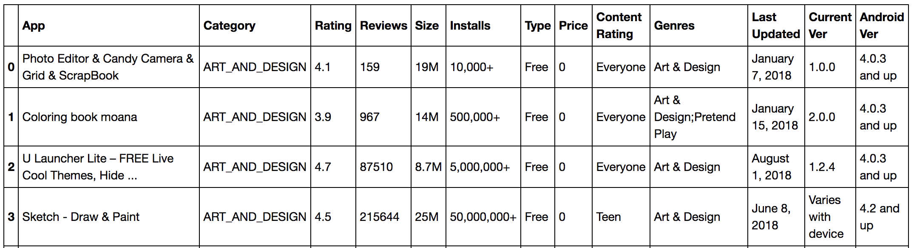

SQL on Modin Dataframes (experimental)
======================================

MindsDB_ has teamed up with Modin to bring in-memory SQL to distributed Modin Dataframes. 
Now you can run SQL alongside the pandas API without copying or going through your disk. 
What this means is that you can now have a SQL solution that you can seamlessly scale 
horizontally and vertically, by leveraging the incredible power of Ray.

A Short Example Using the Google Play Store
""""""""""""""""""""""""""""""""""""""""""""

.. code-block:: python

    import modin.pandas as pd
    import modin.experimental.sql as mdsql

    # read google play app store list from csv
    gstore_apps_df = pd.read_csv("https://tinyurl.com/googleplaystorecsv")

Imagine that you want to quickly select from ‘gstore_apps_df’ the columns 
App, Category, and Rating, where Price is ‘0’.

.. code-block:: python

    # You can then define the query that you want to perform
    sql_str = "SELECT App, Category, Rating FROM gstore_apps WHERE Price = '0'"

    # And simply apply that query to a dataframe
    result_df = mdsql.query(sql_str, gstore_apps=gstore_apps_df)

    # Or, in this case, where the query only requires one table, 
    # you can also ignore the FROM part in the query string:
    query_str = "SELECT App, Category, Rating WHERE Price = '0' "

    # mdsql.query can take query strings without FROM statement 
    # you can specify from as the function argument
    result_df = mdsql.query(query_str, from=gstore_apps_df)

Further Examples and Documentation
"""""""""""""""""""""""""""""""""""
In the meantime, you can check out our `Example Notebook`_ that contains more 
examples and ideas, as well as this blog_ explaining Modin SQL usage.

.. _MindsDB: https://mindsdb.com/
.. _Example Notebook: https://github.com/mindsdb/dfsql/blob/stable/testdrive.ipynb
.. _blog: https://medium.com/riselab/why-every-data-scientist-using-pandas-needs-modin-bringing-sql-to-dataframes-3b216b29a7c0
