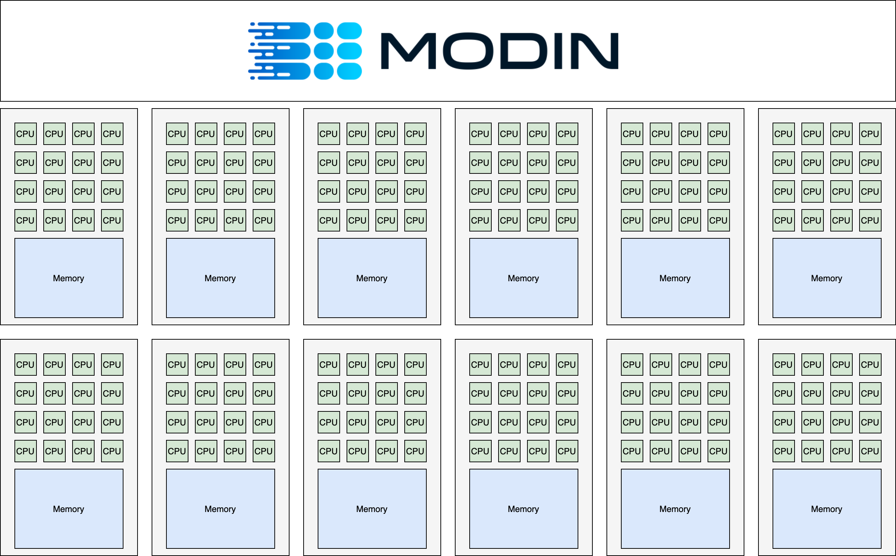

<center>
<h1>Scale your pandas workflows by changing one line of code</h2>
</center>

# Exercise 5: Setting up cluster environment

**GOAL**: Learn how to set up a cluster for Modin.

**NOTE**: This exercise has extra requirements. Read instructions carefully before attempting. 

**This exercise instructs the user on how to start a 700+ core cluster, and it is not shut down until the end of Exercise 6. Read instructions carefully.**

Often in practice we have a need to exceed the capabilities of a single machine. Modin works and performs well in both local mode and in a cluster environment. The key advantage of Modin is that your notebook does not change between local development and cluster execution. Users are not required to think about how many workers exist or how to distribute and partition their data; Modin handles all of this seamlessly and transparently.



**Extra Requirements for this exercise**

Detailed instructions can be found here: https://docs.ray.io/en/latest/cluster/getting-started.html

First of all, please install the necessary dependencies in your environment:
```bash
pip install boto3
```

The next step is setup yout AWS credentionals. We can set 
`AWS_ACCESS_KEY_ID`, `AWS_SECRET_ACCESS_KEY` and `AWS_SESSION_TOKEN` environment variables or just run the following command:

```bash
aws configure
```

## Starting and connecting to the cluster

This example starts 1 head node (m5.24xlarge) and 7 workers (m5.24xlarge), 768 total CPUs.

Cost of this cluster can be found here: https://aws.amazon.com/ec2/pricing/on-demand/.

You can just use the `Ray autoscaler` to create and initialize Ray cluster using the configuration file. This file is included in this directory and is called [`modin-cluster.yaml`](https://github.com/modin-project/modin/blob/master/examples/tutorial/jupyter/execution/pandas_on_ray/cluster/modin-cluster.yaml). You can read more about how to modify `Cluster YAML Configuration file` here: https://docs.ray.io/en/latest/cluster/vms/references/ray-cluster-configuration.html#cluster-yaml-configuration-options
```bash
ray up modin-cluster.yaml
```

Once the cluster initialization is complete, run the following command to connect to it:
```bash
ray attach modin-cluster.yaml
```

Now our console is connected to the cluster head node via ssh and we can run our code there.

# Exercise 6: Executing on a cluster environment

**GOAL**: Learn how to connect Modin to a Ray cluster and run pandas queries on a cluster.

**NOTE**: Exercise 5 must be completed first, this exercise relies on the cluster created in Exercise 5.

Modin lets you instantly speed up your workflows with a large data by scaling pandas on a cluster. In this exercise, we will use the 12.5GB [NYC Taxi dataset](https://modin-datasets.s3.amazonaws.com/testing/yellow_tripdata_2015-01.csv) that was provided with the [executable script](https://github.com/modin-project/modin/blob/master/examples/tutorial/jupyter/execution/pandas_on_ray/cluster/exercise_6.py) as part of our [modin-cluster.yaml](https://github.com/modin-project/modin/blob/master/examples/tutorial/jupyter/execution/pandas_on_ray/cluster/modin-cluster.yaml) configuration file.


We can just run the following command to reproduce these result:
```bash
python exercise_6.py
```

## Shutting down the cluster

Now that we have finished computation, but before we shut down the cluster, we need to exit from ssh console:
```bash
exit
```

Then we can shut down the cluster with `ray down`.

```bash
!ray down modin-cluster.yaml
```

### This ends the cluster exercise
